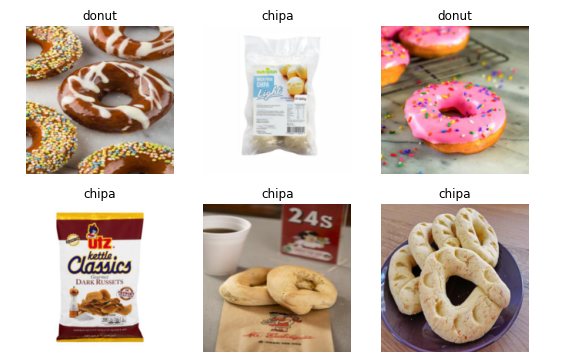

# Is it a Chipa? - Deep Learning Classifier

## Overview

This project aims to solve an essential question: Is it a Chipa? "Chipa" is a type of small bread-like baked good that's popular in Paraguay and other parts of South America. Using deep learning, this project classifies images as either "Chipa" or "Donut"

## Features

- Utilizes Convolutional Neural Networks (CNNs) for image classification.
- Built on top of the fastai library for quick and efficient training.
- Comes with a pre-trained model, fine-tuned specifically for detecting Chipas.
- Provides a Jupyter Notebook that walks you through the process.

## How to Use

1. Clone this repository.
2. Install the required dependencies.
3. Run the Jupyter Notebook to train the model or use the pre-trained model for inference.

## Data

The dataset consists of various images categorized into two classes: "Chipa" and "Not Chipa". For details on the dataset, please refer to the [Kaggle page](https://www.kaggle.com/fernandoleguizamon/is-it-a-chipa).

## Requirements

- Python 3.x
- fastai
- Jupyter Notebook

## License

This project is open-source and available under the MIT License.

